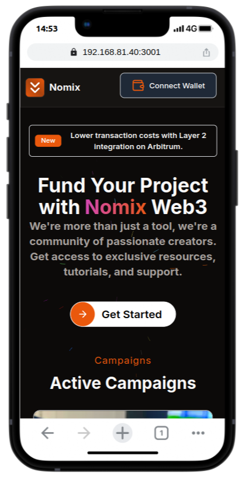

# Nomix  DApp: A Decentralized Crowdfunding
Welcome to the **CrowdFunding DApp**, a decentralized crowdfunding platform built on Ethereum. This project showcases a fully functional smart contract for managing crowdfunding campaigns, integrated with IPFS for decentralized image storage, and a modern front-end built with **Next.js**. This repository is designed to demonstrate my skills in blockchain development, smart contract design, and full-stack development.

|  | |
|---------|---------| 
|  | |

---

## Features

### Smart Contract Features
1. **Campaign Creation**:
   - Users can create campaigns with a name, description, funding goal, minimum donation, deadline, and an image URL (stored on IPFS).
   - Campaigns are stored on the blockchain, ensuring transparency and immutability.

2. **Contributions**:
   - Users can contribute to active campaigns by sending Ether.
   - Contributions are tracked, and donors are recorded.

3. **Refunds**:
   - If a campaign fails to meet its funding goal by the deadline, contributors can claim refunds.

4. **Withdraw Funds**:
   - Campaign creators can withdraw funds once the funding goal is reached.

5. **Campaign Management**:
   - Paginated retrieval of active campaigns.
   - Fetch campaign details by image URL or campaign ID.
   - Retrieve donors and their contributions for any campaign.

6. **IPFS Integration**:
   - Campaign images are stored on IPFS, ensuring decentralized and permanent storage.

### Front-End Features (Next.js)
1. **Campaign Listing**:
   - Display active campaigns with details such as name, description, image, funding goal, and deadline.
   - Paginated view for easy navigation.

2. **Campaign Creation**:
   - Intuitive form for creating new campaigns.
   - Upload images to IPFS and associate them with campaigns.

3. **Contribution**:
   - Users can contribute to campaigns directly from the UI.
   - Real-time updates on total funds raised.

4. **Refunds**:
   - Contributors can claim refunds for failed campaigns.

5. **Withdraw Funds**:
   - Campaign creators can withdraw funds once the goal is met.

---

## Tech Stack

### Blockchain
- **Solidity**: Smart contract development.
- **Ethereum**: Blockchain platform for deploying the contract.
- **IPFS**: Decentralized storage for campaign images.

### Front-End
- **Next.js**: React framework for building the user interface.
- **Tailwind CSS**: Styling the UI components.
- **Ethers.js**: Interacting with the Ethereum blockchain.

### Testing
- **Hardhat**: Development environment for Ethereum smart contracts.
- **Chai**: Assertion library for testing.
- **Mocha**: Test framework for running unit tests.

---

## Smart Contract Details

### Key Functions
1. **`createCampaign`**:
   - Creates a new crowdfunding campaign.
   - Parameters: `name`, `description`, `goal`, `duration`, `min_donation`, `imageUrl`.

2. **`contribute`**:
   - Allows users to contribute to a campaign.
   - Parameters: `campaignId`.

3. **`claimRefund`**:
   - Allows contributors to claim refunds if the campaign fails.
   - Parameters: `campaignId`.

4. **`withdrawFunds`**:
   - Allows campaign creators to withdraw funds if the goal is met.
   - Parameters: `campaignId`.

5. **`getPaginatedCampaigns`**:
   - Retrieves paginated active campaigns.
   - Parameters: `offset`, `limit`.

6. **`getCampaignByImageUrl`**:
   - Fetches campaign details using the IPFS image URL.
   - Parameters: `imageUrl`.

### Events
- **`CampaignCreated`**: Emitted when a new campaign is created.
- **`DonationMade`**: Emitted when a contribution is made.
- **`FundsWithdrawn`**: Emitted when funds are withdrawn by the creator.
- **`RefundClaimed`**: Emitted when a refund is claimed.

---

## IPFS Integration

Campaign images are uploaded to **IPFS** (InterPlanetary File System), ensuring decentralized and permanent storage. The IPFS URL is stored in the smart contract and fetched by the front-end to display campaign images.

### How It Works:
1. Users upload images to IPFS when creating a campaign.
2. The IPFS hash is stored in the `Campaign` struct.
3. The front-end fetches the image from IPFS using the stored URL.

---

## Front-End (Next.js)

The front-end is built with **Next.js**, providing a modern and responsive user interface. Key features include:

1. **Campaign Listing**:
   - Displays active campaigns with details such as name, description, image, funding goal, and deadline.
   - Paginated view for easy navigation.

2. **Campaign Creation**:
   - Users can create new campaigns by filling out a form.
   - Images are uploaded to IPFS and associated with the campaign.

3. **Contribution**:
   - Users can contribute to campaigns by sending Ether directly from the UI.

4. **Refunds**:
   - Contributors can claim refunds for failed campaigns.

5. **Withdraw Funds**:
   - Campaign creators can withdraw funds once the goal is met.

---

